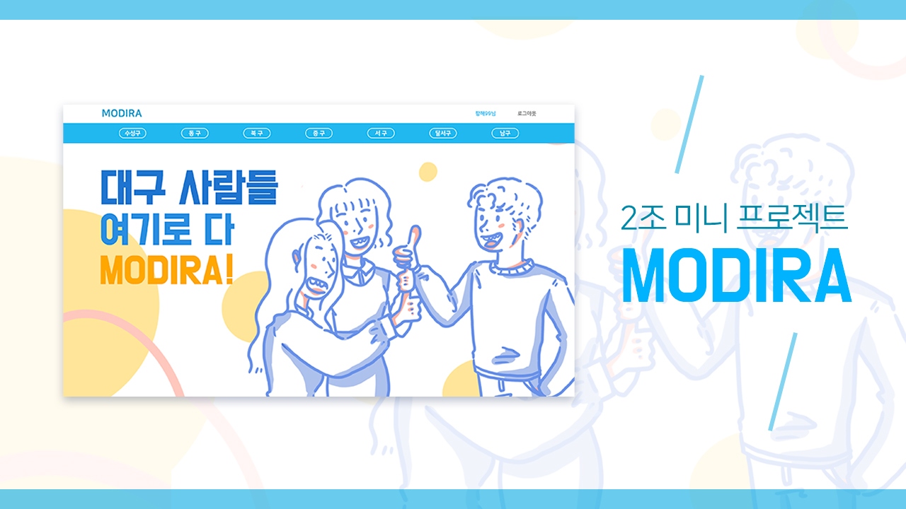

## Modira 소개
MODIRA - 대구 사람들의 모임
## 프로젝트 개요
 
'모디라’는 대구 사투리로 ‘모여라’라는 뜻 입니다. 대구에서 거주하는 사람들에게
 
다양한 모임을 만들거나 참여할 수 있도록 도와주는 프로젝트입니다. 

#### 🗓 2022.07.21 - 2022.07.28 (1주)
#### 🙋‍♂️ 팀원

<table>
  <tr>
    <td colspan="1">Front-End</td>
    <td colspan="3">Back-End</td>
  </tr>
  <tr>
    <td>조수빈</td>
    <td>배소정</td>
    <td>장정훈</td>
    <td>안상록</td>
  </tr>
  <tr>
    <td></td>
    <td></td>
    <td></td>
    <td></td>
  </tr>
</table>

#### 🔗 link

- [시연영상](https://youtu.be/zuK9re3IYMM)
- [Team notion](https://www.notion.so/SA-2-6b7a177966d849e99425a7bceb5d7ba2#49ab9ad773c94ceebf61fa3f773112c6)
- [Github Back-End repo](https://github.com/AhnSangRok/Modira)
- [Github Front-End repo](https://github.com/whtnqls124578/react_miniproject)

 

## 주요 기능
- 제공페이지 : 로그인, 회원가입, 메인페이지, POST 작성 페이지, POST 상세페이지
- JWT를 활용한 회원가입 & 로그인
- 게시물 CRUD 기능 

 

## 사용한 기술스택
# 프론트엔드
- React, Axios, Redux
# 백엔드
- Spring, JPA, MYSQL, GRADLE, GitHub, AWS, Spring Security